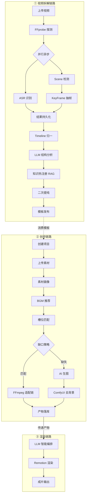
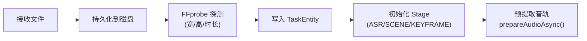
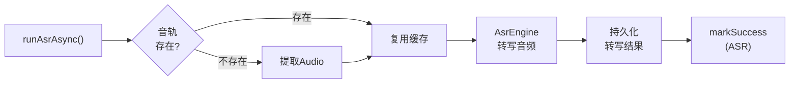
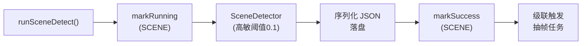
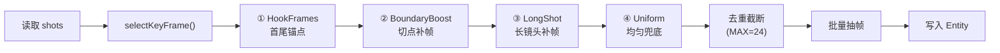
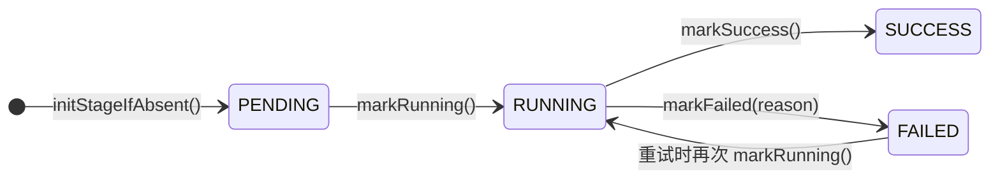
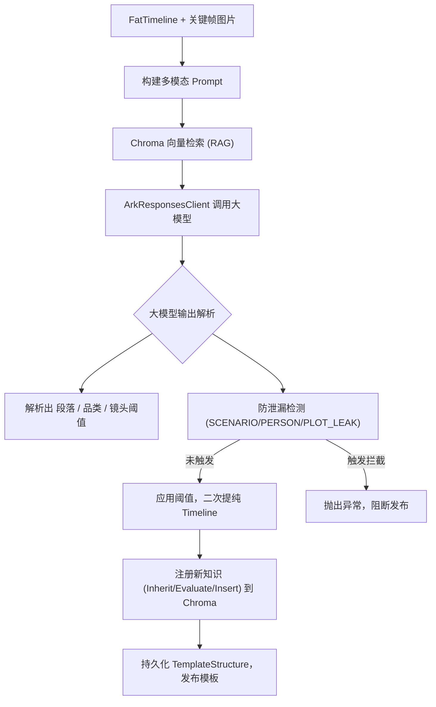
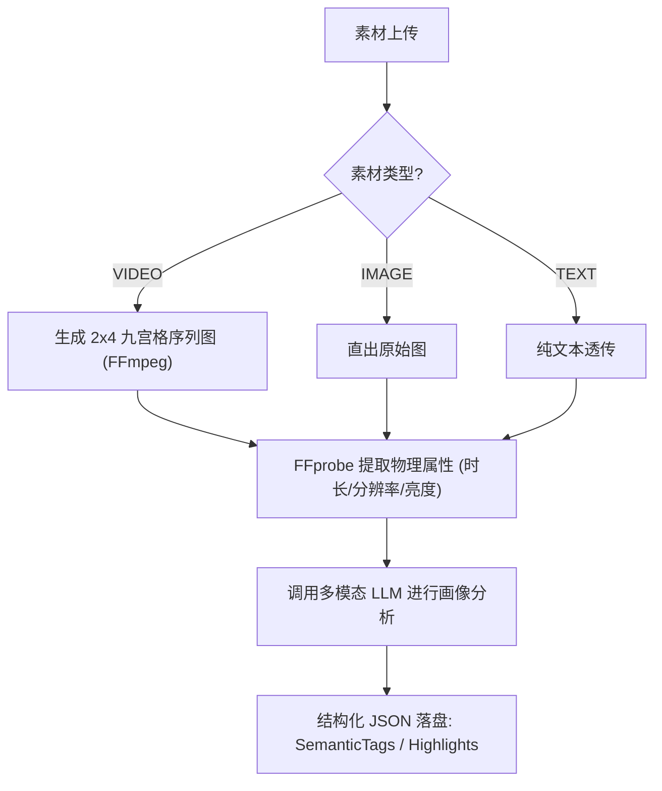
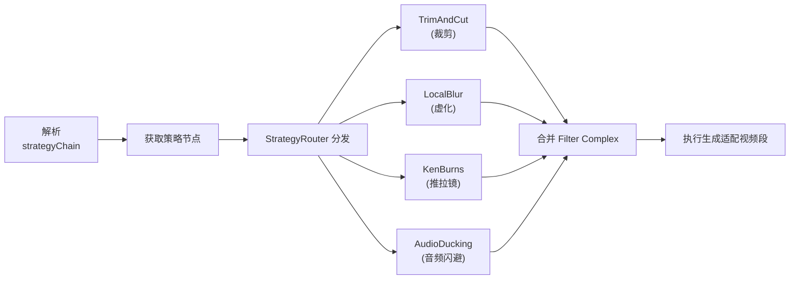

# 06 - 核心业务逻辑与策略树

> 本文档聚焦 RedStVE 平台后端的 **核心执行路径与策略决策树**，不涉及 CRUD / 协议设计等细枝末节，但会明确标注"上一阶段产出的哪些字段将被下一步策略消费"。

---

## 目录

1. [全局策略树总览](#1-全局策略树总览)
2. [视频拆解链路](#2-视频拆解链路)
   - 2.1 上传与初始化
   - 2.2 ASR 异步分析
   - 2.3 场景检测
   - 2.4 关键帧抽取（Hook-Locking 算法）
   - 2.5 阶段状态机
   - 2.6 时间轴归一器（TimelineMatcher）
   - 2.7 LLM 结构分析与品类知识自进化
   - 2.8 拆解链路字段消费链
3. [创作链路（素材适配流）](#3-创作链路素材适配流)
   - 3.1 素材画像
   - 3.2 模板推荐与 BGM 推荐
   - 3.3 槽位匹配与缺口识别
   - 3.4 适配编排与策略路由
   - 3.5 AI 生图补全
   - 3.6 受保护资产识别
4. [渲染链路](#4-渲染链路)
   - 4.1 LLM 编排
   - 4.2 Remotion 渲染提交
   - 4.3 FFmpeg 原子策略清单
   - 4.4 创作链路字段消费链

---

## 1. 全局策略树总览

系统的完整生命周期可概括为 **"拆解 → 抽象 → 匹配 → 适配 → 渲染"** 五步闭环：



**架构与演进意图**：
此全局图展示了平台有别于传统剪辑工具的 **AI 数据飞轮闭环**。左侧的【拆解链路】负责“学习与抽象”：将优秀视频反向解构，提取核心叙事结构和品类节奏，并热注册到向量知识库中。右侧的【创作链路】负责“推理与生产”：基于知识库中沉淀的模板，结合大模型的多模态理解能力，对零散素材进行自动化匹配、物理适配及缺口生图补全，最终交由 Remotion 渲染引擎合成为完整成片。

### 两大核心链路简介

| 链路 | 入口 | 核心职责 | 产出物 |
|------|------|----------|--------|
| **拆解链路** | `VideoUploadService.handleSingleFile()` | 将一个原始视频拆解为可复用的结构模板 | `DeconstructTemplate`（含段落结构、节奏结构、品类特征） |
| **创作链路** | `CreationProjectServiceImpl.generateVideo()` | 基于模板 + 用户素材生成成片 | Remotion 渲染的 MP4 视频 |

---

## 2. 视频拆解链路

### 2.1 上传与初始化

**入口**：`VideoUploadService.handleSingleFile(MultipartFile, taskId)`



**前置元数据探测**：
系统在文件落盘后，第一时间执行 FFprobe 获取长宽比、码率、时长等底层物理基准数据。这一步骤为后续的 FFmpeg 裁剪策略、防形变伸缩以及大模型耗时预估提供了最基础的依赖保障。

**核心逻辑要点**：
- FFprobe 探测结果写入 `VideoAnalysisTaskEntity`，包括 `sourceFilePath`、`width`、`height`、`duration`、`videoCodec`、`audioCodec`。
- 调用 `VideoTaskStageService.initStageIfAbsent()` 初始化 `ASR`、`SCENE`、`KEYFRAME` 三个阶段为 `PENDING` 状态。
- 音轨预提取为**非阻塞操作**，异步执行 `AsrAnalysisService.prepareAudioAsync()`，将音频文件（MP3）缓存到 `{audioOutputDir}/{taskId}/audio.mp3`。

### 2.2 ASR 异步分析

**入口**：`AsrAnalysisService.runAsrAsync(taskId)` — `@Async("videoTaskExecutor")`



**多维听觉特征提取**：
ASR 引擎的设计目标超越了单纯的文本转写。除了通过文字内容推断段落语义意图外，引擎还致力于提取音量起伏、环境噪声分类等声学特征，从而在后续的归一化环节中，与视觉切分点产生“视听共振”，大幅提升大模型识别视频起承转合的精准度。

**产出字段**（写入 `AsrSegmentEntity` 表）：

| 字段 | 说明 | 下游消费者 |
|------|------|-----------|
| `text` | 逐句转写文本 | TimelineMatcher → LLM |
| `startTime` / `endTime` | 时间锚点 | TimelineMatcher 按时间窗口归属 |
| `audioEmotion` | 音频情绪标签 | TimelineMatcher → `AudioTextEntry` |
| `volumeIntensity` | 音量强度 (HIGH/PEAK/...) | TimelineMatcher 视听共振判定 |
| `backgroundEnvironment` | 背景环境 (MUSIC_FX/...) | TimelineMatcher 视听共振判定 |
| `vocalVibe` | 人声风格 | TimelineMatcher → AudioSemanticSummary |
| `bgmGenre` / `bgmInstruments` | BGM 风格与乐器 | TimelineMatcher → AudioSemanticSummary |

### 2.3 场景检测

**入口**：`SceneAnalysisService.runSceneDetectAsync(taskId)` — `@Async("videoTaskExecutor")`



**召回率优先的高敏切分策略**：
场景检测节点（`SceneDetectorEngine`）刻意采用了低物理阈值（`0.1`）的“高敏提取模式”。此设计的核心思想是**防御性召回优先**，即将视频在物理层面细致切分，保留所有潜在转场并附配置信度（`sceneScore`），随后将全量信息递交大模型。由 AI 结合整体上下文进行逻辑层的剪辑合并，避免在早期因硬编码规则导致关键切点信息的丢失。

**关键设计决策**：
- **高敏提取模式**：`HIGH_SENSITIVITY_THRESHOLD = 0.1`，采用极低物理阈值切分，目的是**保留全部候选切点**，供下游 `TimelineMatcher` 按品类阈值二次过滤。
- 场景检测完成后**立即级联触发**关键帧抽取，形成 `SCENE → KEYFRAME` 的串行依赖。

**产出物**：`{uploadDir}/{taskId}/scene_result.json`

| 字段（SceneShot） | 说明 | 下游消费者 |
|---|---|---|
| `startTime` / `endTime` | 镜头时间边界 | KeyFrameAnalysis、TimelineMatcher |
| `sceneScore` | 切分置信度 | TimelineMatcher 后置过滤、高价值 cut 判定 |
| `shotIndex` | 镜头序号 | KeyFrame 归属标记 |
| `duration` | 镜头时长 | 长镜头中点补帧判定 |

### 2.4 关键帧抽取（Hook-Locking 算法）

**入口**：`KeyFrameAnalysisService.runExtractAsync(taskId)` — `@Async("videoTaskExecutor")`

这是系统中算法密度最高的模块，采用 **Hook-Locking 四层策略选点**：



**算力成本与语义保全平衡（Hook-Locking 算法）**：
为避免全量视频帧输入导致的多模态大模型 Token 灾难及耗时失控，系统引入了自研的四层 Hook-Locking 策略。通过针对高优先级节点（如全片黄金 3 秒、高置信度转场切点）的强锁定，以及对长镜头的均匀补偿，该算法能将数分钟的视频精准降维至不超过 24 帧的黄金骨架序列，在极致压缩算力开销的同时，保证了视频语义的完整传递。

**四层策略细节**：

| 层级 | 策略名 | 优先级 | 触发条件 | 产出的 `extractionReason` |
|------|--------|--------|----------|--------------------------|
| P0 | Hook 首帧 | 0 | 首镜头 startTime + 0.10s | `HOOK_FIRST` |
| P0 | Hook 中帧 | 1 | 首镜头中点 | `HOOK_MID` |
| P1 | 切点补帧 | 2 | `sceneScore ≥ 0.15` 的切点前后 ±0.15s | `BOUNDARY_PRE` / `BOUNDARY_POST` |
| P2 | 长镜头中点 | 3 | 镜头时长 ≥ 2.5s 且已有帧 < 2 | `LONG_SHOT_MID` |
| P3 | 均匀采样 | 4 | 每 2.0s 一帧，跳过已有帧 ±0.6s 范围 | `UNIFORM_SAMPLE` |

**去重与截断算法** `normalizeAndTrim()`：
1. 按优先级排序（P0 → P3），同优先级按时间排序。
2. 逐帧插入结果集，跳过与已有帧间距 < `0.08s` 的候选。
3. 结果集达到 `MAX_FRAMES = 24` 后截断。

### 2.5 阶段状态机

**服务**：`VideoTaskStageService`



**并发场景下的工业级状态机**：
由于视频大文件的特征提取（ASR、场景检测等）极度耗时且常在微服务环境下并行执行，系统放弃了脆弱的单字段进度机制，转而采用独立表与乐观锁维护细粒度的阶段（Stage）状态。此设计实现了阶段间的错误隔离与断点续传，赋予了分析引擎在应对高并发写回时的数据一致性和工程健壮性。

**设计动机**：将 ASR / SCENE / KEYFRAME / TIMELINE / LLM 五个阶段的状态解耦到独立的 `VideoTaskStageEntity` 表中，避免单一 `progress_step` 字段在并发异步回写时发生状态覆盖。

---

### 2.6 时间轴归一器（TimelineMatcher）

**服务**：`TimelineMatcherService.match(...)`

由于 ASR（语音）、Scene（物理镜头）、KeyFrame（抽帧画面）的粒度完全不同，必须通过时间轴归一化，将三者对齐到同一个基准结构上。

**归一化算法流程**：
1. **基准选择**：以 SceneShot（物理镜头）的时间区间 `[startTime, endTime]` 为主骨架。
2. **挂载 KeyFrame**：遍历当前 SceneShot 范围内的所有 KeyFrame。将画面特征（包含基础分析结果如光流、色彩等，如果有的话）挂载到该镜头的视觉特征槽位。
3. **挂载 ASR**：计算 ASR 语音片段与 SceneShot 的时间重叠率（IoU 机制）。
   - 如果重叠率 `> 30%`，将 ASR 文本归属到该镜头。
   - 跨镜头长语音：会被切割或根据主次镜头分配。
4. **产物**：聚合生成 `FatTimelineSegment`（全量胖时间轴节点）。

**闭环契约设计（双向调用）**：
- **第一次提纯（高敏向）**：`match(highSensitivityThreshold)`，将所有的物理微小镜头及提取的密集特征喂给大模型。
- **第二次提纯（业务向）**：`match(llmReturnedSceneThreshold)`，当大模型分析出该视频的品类并给出品类专属的镜头合并阈值（例如：Vlog 容忍 0.8s 细碎镜头，而口播只容忍 0.3s），再次调用 `match` 合并极短镜头，输出最终业务视角的 `TemplateStructure`。

### 2.7 LLM 结构分析与品类知识自进化

**核心编排**：`StructureAnalyzerServiceImpl.analyzeAndRefine()`

这是整个拆解链路的最强大脑。基于聚合后的 Timeline，通过多模态大模型推导视频的段落结构、分镜意图和整体风格。



**业务闭环与护城河：知识演化与隐私防线**：
大模型结构分析是拆解链路的最强算力节点，其不仅负责从庞杂的物理 `FatTimeline` 中提炼逻辑结构（起承转合），更承载了两项核心系统机制：
1. **品类知识自进化**：每成功解析一个结构化模板，系统会提取该品类的节拍规律和阈值存入 Chroma，反哺未来的 RAG 检索，形成越拆越准的“知识飞轮”。
2. **后置防泄漏拦截**：针对大模型可能产生的幻觉或隐私过度挖掘（如具体人名、车牌、私密剧情），引擎内置了黑名单检测与熔断器，一旦触碰 `SCENARIO/PERSON/PLOT_LEAK` 阈值，则拒绝将解析结果固化为公共模板，坚守内容安全底线。

**关键设计：品类知识自进化契约**
- **Inherit (继承)**：检索当前库中相似视频的 `TemplateStructure` 作为 few-shot reference 传给 LLM。
- **Evaluate (评估)**：LLM 根据当前视频的特殊性，对 reference 中的分段逻辑进行微调，并输出更优的合并阈值。
- **Insert (热注册)**：将新产出的高质量结构化模板，作为新知识向量化后存入 Chroma，反哺未来的同类视频拆解。

**防御性设计**：
在 `StructureAnalyzerServiceImpl` 中内置了关键词拦截逻辑：如果大模型在总结 `description` 或 `semanticTags` 时，输出了过于具体的人名、剧情剧透、或私密场景特征，系统会立即阻断该模板的发布。这被称为 `SCENARIO/PERSON/PLOT_LEAK` 拦截。

### 2.8 拆解链路字段消费链

下表展示了拆解链路中产生的数据字段最终将如何在 **创作链路** 中被消费：

| 拆解产出字段 | 生成阶段 | 消费方 (创作链路) | 消费目的 |
|---|---|---|---|
| `templateStructure.segments[].role` (Hook/Body/Climax) | LLM 结构分析 | SlotMatcher | 匹配缺口时的素材优先级计算。例如 Hook 位优先匹配表现力强的素材。 |
| `templateStructure.segments[].minDuration` | TimelineMatcher | AdaptationOrchestrator | 判定素材是否足够长，决定是否需要执行循环 (Loop) 或慢放 (Slomo) 策略。 |
| `templateStructure.meta.overallStyle` | LLM 结构分析 | BgmRecommendService | 作为向量检索的 Query 补充，提升 BGM 推荐的风格契合度。 |
| `templateStructure.category` (品类) | LLM 结构分析 | VectorStore (Chroma) | 知识图谱自进化，作为元数据隔离 RAG 检索的边界。 |

---

## 3. 创作链路（素材适配流）

创作链路的核心目标是：将用户上传的凌乱素材，通过 **AI 匹配与物料补全**，完美填充到拆解生成的结构化模板中。

### 3.1 素材画像 (Asset Profiler)

**入口**：`AssetProfilerServiceImpl.profileAsset()`

不论是视频、图片还是文本素材，上传后都必须经过画像提取，这是后续槽位匹配的基础。



**物理与语义双重特征提取**：
为应对用户上传质量参差不齐的泛杂素材，系统在此阶段建立统一的数据“清洗间”。除常规利用 FFprobe 检测分辨率和曝光度外，进一步引入大模型针对视频九宫格序列进行深度语义解读（如环境基调、情感倾向），确保后续的槽位匹配能够基于多维度的精准画像进行客观决策。

**关键产物**：`profileJson`（包含 `overallStyle`, `mainEntities`, `emotionTone` 等语义标签）。

### 3.2 模板推荐与 BGM 推荐

**核心算法**：`BgmRecommendServiceImpl.recommend()`

利用前面生成的素材画像（`overallStyle`、`emotionTone`、`mainKeywords`）作为搜索 Query，在 Chroma 向量库中进行检索。

**推荐得分公式**：
`FinalScore = (SemanticScore * W1) + (EnergyCurveScore * W2) + (DurationBpmScore * W3)`

- **SemanticScore**: RAG 向量相似度。
- **EnergyCurveScore**: 基于大模型推断的 BGM 能量曲线与模板起伏的匹配度（存在 **Hard Veto 一票否决机制**）。
- **DurationBpmScore**: 物理时长匹配比例计算。

### 3.3 槽位匹配与缺口识别

**入口**：`SlotMatcherServiceImpl.matchSlots()`

将用户的素材列表与 `TemplateStructure` 的段落槽位进行连线。由于用户上传的素材往往不符合模板的理想要求，这一步必须**容忍残缺**。

**匹配状态机 (MatchStatus)**：
- `MATCHED`：完美匹配。
- `PARTIAL`：部分匹配，后续需要拉伸、裁剪等策略补偿。
- `MISSING`：**素材缺口**（用户没传够，或者传的都不符合要求）。
- `VETOED`：被大模型一票否决的强制冲突（例如要求风景，用户只传了人像）。

### 3.4 适配编排与策略路由

**核心调度**：`AdaptationOrchestratorServiceImpl.orchestrateAdaptation()`

这是将抽象逻辑映射到物理 FFmpeg 命令的关键纽带。针对每一个槽位（Slot），无论其状态是 `MATCHED` 还是 `PARTIAL`，LLM 都会生成一个 `strategyChain`（例如 `[TRIM_AND_CUT, LOCAL_BLUR, AUDIO_DUCKING]`）。

**策略路由器 (StrategyRouter)**：
系统实现了高度解耦的策略执行机制。`StrategyRouter` 类似于一个工厂，根据 `strategyType` 动态分发给对应的 `StrategyExecutor` 实现类。



**契合 OCP 原则的动态策略路由**：
作为 AI 引擎的执行末梢，适配编排模块实现了高内聚低耦合的工程架构。大模型仅负责输出轻量级的抽象策略链（如标识符数组），由核心组件 `StrategyRouter` 动态分发至具体的原子策略执行器（`Executor`）。此架构使得每个执行器专注构建特定的 FFmpeg `Filter Complex` 指令，未来若需新增滤镜策略，只需增加对应的子类实现，无需侵入并修改上层模型提示词与编排主干，严格遵循了软件设计的开闭原则（OCP）。

**性能优化**：`isVideoFilterChainEligible`
如果多个连续的视觉策略（如裁剪后直接加滤镜）不涉及复杂的 filter_complex 映射，系统会将其合并为单条 `-vf` 命令执行，避免多次解码/编码的性能损耗。

### 3.5 AI 生图补全与去背景

针对 `MATCH_STATUS_MISSING` 且被标记为 `imageGenEligible = true` 的槽位，系统会触发自动化资产补全。

- **触发条件**：素材缺口 + 模板该段落允许使用静态图。
- **Seedream 生图**：根据 LLM 给出的 `imageGenPrompt`，调用 Seedream API 生成补全图片。
- **ComfyUI 去背景**：如果 `imageGenCategory` 属于特定的分类（如 `UI_ELEMENT`, `STICKER`, `LOGO`），系统会在生图后进一步调度本机的 ComfyUI 工作流（通过 `ComfyuiBgRemovalService`），利用基于 RMBG-1.4 或 Bria 等模型的抠图节点，将白底/纯色背景去除，输出带 Alpha 通道的 PNG 图片，供后续 Remotion 无缝贴合渲染。

### 3.6 受保护资产识别 (Privacy Defense)

为避免企业标识或敏感物料被不可控的裁剪或模糊策略破坏，系统实施了资产保护隔离：

```java
private static final Set<String> PROTECTED_VISUAL_KEYWORDS = Set.of(
    "logo", "brand_logo", "wordmark", "icon", "badge", "mascot", "徽标"
);
```

**隔离逻辑**：在 `AdaptationOrchestratorServiceImpl.isProtectedVisualAsset` 中，如果素材的原文件名、标签或 LLM 画像（`semanticTags`）命中保护词，该素材将**跳过所有的 FFmpeg 视觉策略变异**，原封不动地保留（Fallback 到 `copySourceAsset`），直接推入 Remotion 渲染队列。

---

## 4. 渲染链路

当所有的素材完成物理层面的 FFmpeg 裁剪、缩放、补全等前置处理后，就进入最终的渲染管线。

### 4.1 LLM 智能编排 (CompositionScript)

**核心服务**：`VideoOrchestrationService.orchestrateVideoResult()`

利用大模型（Ark Responses Client）将处理好的素材，与原始模板结合，生成一份严格遵循 `CompositionScript` 数据结构的 JSON，这也是最终传递给 React/Remotion 微服务的 DSL（领域特定语言）。

**核心能力：多版本生成策略注入**
平台支持根据策略一键变换生成风格，这是在这一层通过 Prompt 注入实现的：
- **`fast_paced` (高频卡点版)**：要求大幅缩短 durationInFrames，强制使用 wipe 快速转场，将 BGM mixLevel 强设为 `DRIVE`。
- **`brand_quality` (品牌质感版)**：减少字幕密度，强制使用 fade 慢速淡入，将 BGM mixLevel 强设为 `QUIET` 或 `BALANCED`，全局风格使用优雅字体。

**容错与清理**：
LLM 返回的 JSON 可能会有字段缺失或错误。系统通过 `sanitizeCompositionScript` 方法进行自动清洗补全（例如：缺失 `durationInFrames` 时自动推断场景长度；对需要音效的图层如 `media.audio` 自动补全映射的 `src`）。

### 4.2 Remotion 微服务渲染

将 `CompositionScript` 作为 `inputProps` 发送给前端架构体系中的独立 Remotion Node.js 微服务进行最终的无头渲染（Headless Rendering），最终合成出带有转场、文字特效、音效闪避的 MP4 视频。

### 4.3 FFmpeg 原子策略清单 (Strategy Executors)

在创作链路（第3节）中，`StrategyRouter` 支持分发以下底层视频处理策略：

| 策略标识符 (`strategyType`) | 对应的 Executor | 核心作用与 FFmpeg 处理逻辑 |
|---|---|---|
| `TRIM_AND_CUT` | `TrimAndCutExecutor` | 裁剪时间片段，处理部分匹配时素材过长的问题。 |
| `SMART_CROP` | `SmartCropExecutor` | 智能画幅裁切。将 16:9 裁剪为 9:16 或相反，自动补充黑边或拉伸。 |
| `LOCAL_BLUR` | `LocalBlurExecutor` | 局部高斯模糊。利用 `boxblur` 滤镜填充上下黑边。 |
| `LOOP_SEQUENCE` | `LoopSequenceExecutor` | 素材短缺时，利用 `-loop 1` 无限循环短视频或静态图补充时长。 |
| `AUDIO_DUCKING` | `AudioDuckingExecutor` | 音频闪避。当识别到人声（ASR）时，通过 `sidechaincompress` 压低 BGM 音量。 |
| `KEN_BURNS_MOTION` | `KenBurnsMotionExecutor` | 为静态图添加缓慢推拉摇移（Pan & Zoom）效果，使其动态化。 |
| `LIGHTING_ADJUST` | `LightingAdjustExecutor` | 针对过曝或欠曝素材，利用 `eq` 滤镜自动修正亮度与对比度。 |

### 4.4 创作链路字段消费链

下表展示了创作链路中产生的数据字段将如何在最终的 **渲染步骤** 中被消费：

| 链路产出字段 | 产出者 | 消费方 (Remotion 渲染引擎) | 消费目的 |
|---|---|---|---|
| `slotMatchResult.adaptedFilePath` | AdaptationOrchestrator | `CompositionScript` 组装 | 替换原始素材，将处理后的视频片段作为 `<OffthreadVideo>` 组件的 `src`。 |
| `imageGenUrl` / `imageGenCategory` | SlotMatcher (AI生图) | `CompositionScript` 组装 | 作为 `` 组件的数据源，生成静态插图或去背后的 PNG 贴纸。 |
| `bgm.mixLevel` (DRIVE/QUIET/BALANCED) | VideoOrchestrationService | Remotion `Audio` 标签 | 控制 BGM 轨道的基础音量大小，实现多版本风格切换。 |
| `globalStyle.fontTier` | VideoOrchestrationService | Remotion 文本渲染引擎 | 根据品牌质感或激进风格，映射加载不同的 Google Fonts Web 字体集。 |

---
*文档完*
